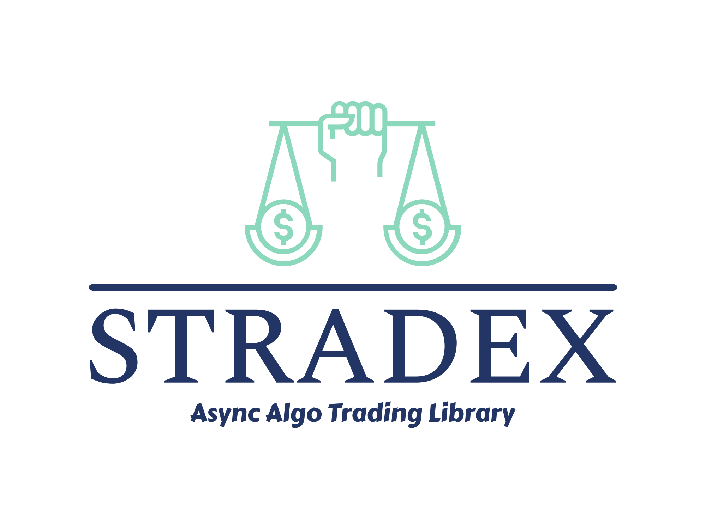

# Stradex : Strategy, Trade, Execution for Quants

Stradex is an Event-driven and asynchronous algorithmic trading framework written in C++ and Python.

## License
Stradex is licensed under Apache-2.0.
